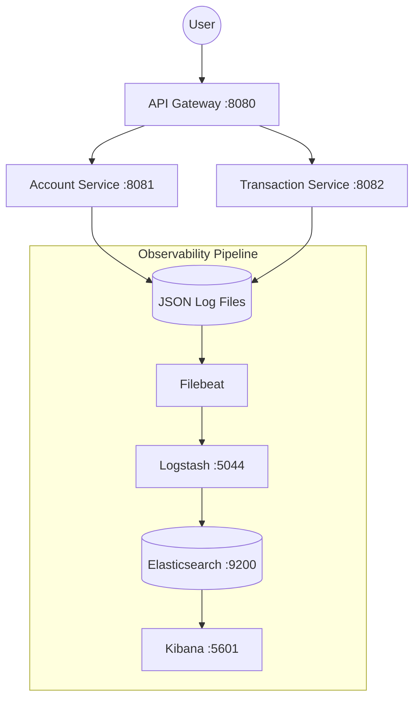

# 🚀 Observability Guide: ELK Stack + Java Logging

> A master reference built from the **bank-transaction-platform** project. 
> This document explains the architecture, the "Why" behind our choices, and how to maintain the pipeline.

---

## 📋 What's Inside

| Section | What You'll Learn |
|:---|:---|
| **Big Picture** | How all 8 containers connect in a distributed flow |
| **ELK Stack** | Deep dive into Elasticsearch, Logstash, Kibana, and Filebeat |
| **Java Logging** | SLF4J → Logback → Appenders explained simply |
| **MDC Tracing** | Why `traceId` appears in every log across services automatically |
| **logging-common** | How our shared library standardizes the whole system |
| **Complete Log Entry** | Exactly what a pro-level JSON log looks like with all fields |
| **Distributed Tracing** | How one `traceId` connects Gateway + Service logs |
| **Index Template** | Why field types (keyword vs text vs ip) are critical for search |
| **Data Streams** | Why we use Data Streams instead of old-school daily indices |
| **10 Issues + Fixes** | Every bug we hit, the root cause, and the exact "Pro" fix |
| **Kibana Cheat Sheet** | Ready-to-use search queries for high-speed debugging |
| **Useful Commands** | All the curl/docker commands in one handy place |
| **What to Learn Next** | Dashboards, Alerts, ILM, and Kubernetes ELK |

---

## 1. 🏗️ The Big Picture

Our architecture uses a "Sidecar" pattern for log collection. Services write logs to disk, and **Filebeat** ships them to the centralized stack.

---

## 2. ⚡ The ELK Stack + Filebeat

| Tool | Role | Why It Matters |
|:---|:---|:---|
| **Elasticsearch** | **The Brain** | A distributed search engine that indexes logs as JSON documents. |
| **Logstash** | **The Transformer** | A processing pipeline that can enrich logs (e.g., GeoIP) before storage. |
| **Kibana** | **The Lens** | The web interface for searching, visualizing, and alerting on logs. |
| **Filebeat** | **The Courier** | A tiny, fast agent that reads log files and ensures "At-Least-Once" delivery. |

---

## 3. ☕ Java Logging Architecture

We use **SLF4J** as our API and **Logback** as our engine. This is the industry standard for Spring Boot.

### 3.1 Structured Logging (LogstashEncoder)
Instead of writing plain text lines like:
`2026-04-24 ERROR Account not found`

We write **Structured JSON** directly to disk:
`{"@timestamp":"2026-04-24T...","level":"ERROR","message":"Account not found"}`

**Why?** Because machines (Filebeat/Logstash) can parse JSON instantly without complex and brittle Regex patterns.

---

## 4. 🔗 MDC & Distributed Tracing

**MDC (Mapped Diagnostic Context)** is a thread-local map. We use it to "tag" every log line with metadata without manually adding it to every `log.info()` call.

### How a `traceId` travels:
1. **Gateway** receives a request and generates a unique `traceId`.
2. **LoggingFilter** puts this ID into the **MDC**.
3. When the Gateway calls **Account Service**, it passes the ID in the HTTP Header.
4. **Account Service** picks up the header and puts it in its own **MDC**.
5. **Result:** Logs from both services share the SAME `traceId`, making them easy to correlate in Kibana.

---

## 5. 🛡️ Mapping & The Index Template

This was a critical step in stabilizing our pipeline. We used a **Priority 500 Composable Template**.

### Key Field Mapping Choices:
| Field | Type | Rationale |
|:---|:---|:---|
| `http.clientIp` | `ip` | Enables CIDR searches (e.g., search all logs from a specific subnet). |
| `error.stack` | `text` | Stack traces are huge. Mapping as `text` prevents "Ignore Above" errors. |
| `service` | `keyword` | Keywords are not "analyzed," allowing for exact-match filtering. |
| `status` | `integer` | Allows numeric range queries (e.g., `status >= 500`). |

---

## 6. 🌊 Data Streams vs. Daily Indices

We upgraded from daily indices (e.g., `bank-logs-2026.04.24`) to **Data Streams** (`bank-logs`).

**Why Data Streams?**
- **Simplified Management**: You only ever point Filebeat to `bank-logs`. 
- **Automatic Rollover**: Elasticsearch handles creating new backing indices behind the scenes.
- **Append-Only**: Optimized for time-series data like logs.

---

## 7. 🛠️ 10 Issues We Hit & Their "Pro" Fixes

| Issue | Root Cause | The Fix |
|:---|:---|:---|
| **Build Failure** | Missing `java.util.*` imports in Common Logging. | Added `Map` and `HashMap` imports to `GlobalExceptionHandler`. |
| **Ignored Stack Traces** | `error.stack` was dynamically mapped as a `keyword`. | Forced `text` mapping in the index template. |
| **Template Not Applied** | Pattern `bank-logs*` didn't match `.ds-bank-logs...` | Updated pattern to `*bank-logs*` to catch Data Stream indices. |
| **Index Conflict** | Two templates had the same priority. | Set our custom template priority to `500`. |
| **Missing Metadata** | `logger_name` field didn't match the ECS `logger` standard. | Standardized Logback field names across all services. |
| **Log Files Missing** | Path mismatch between Container and Host. | Synchronized Docker volumes in `docker-compose.yml`. |
| **Gateway Crash** | Spring MVC dependency in a Reactive (WebFlux) service. | Excluded MVC dependencies and set `web-application-type: reactive`. |
| **Filebeat Crash** | Invalid `test:` block in timestamp processor. | Removed deprecated configuration blocks from `filebeat.yml`. |
| **Logs Not Flushing** | Async appender buffer was too large for low traffic. | Switched to `immediateFlush=true` for real-time visibility. |
| **Auth 401 Errors** | X-Pack security enabled but no credentials used. | Implemented `-u elastic:BankAdmin123` in all pipeline calls. |

---

## 🔍 8. Kibana Cheat Sheet (Ready-to-Use)

Copy-paste these into the Kibana search bar for instant insights:

| Goal | Search Query |
|:---|:---|
| **All Errors Today** | `level: "ERROR"` |
| **Trace a single Request** | `traceId: "YOUR_ID_HERE"` |
| **Find "High" Severity Bugs** | `error.severity: "HIGH"` |
| **Monitor one Service** | `service: "account-service"` |
| **Find all 404 Not Founds** | `http.status: 404` |
| **Search by Client IP** | `http.clientIp: "172.18.0.1"` |

---

## 👨‍💻 Author's Note
This guide was created during the stabilization phase of the **Bank Transaction Platform** to ensure that the complex logic of distributed observability is documented for future scale.
